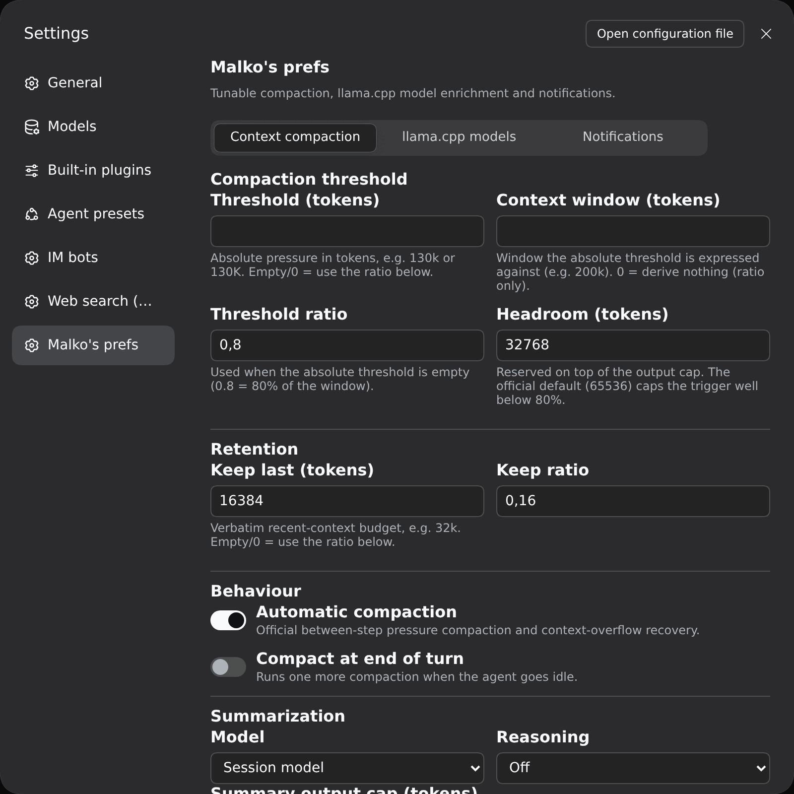
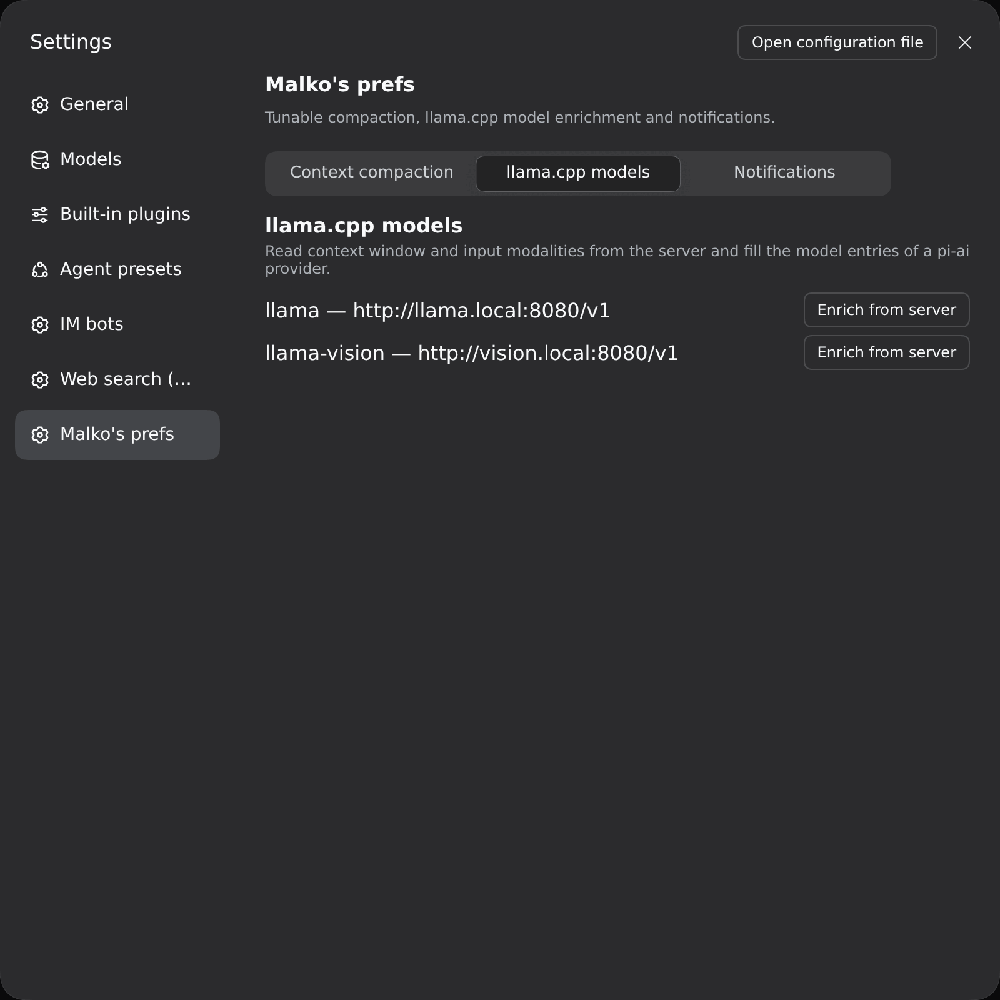
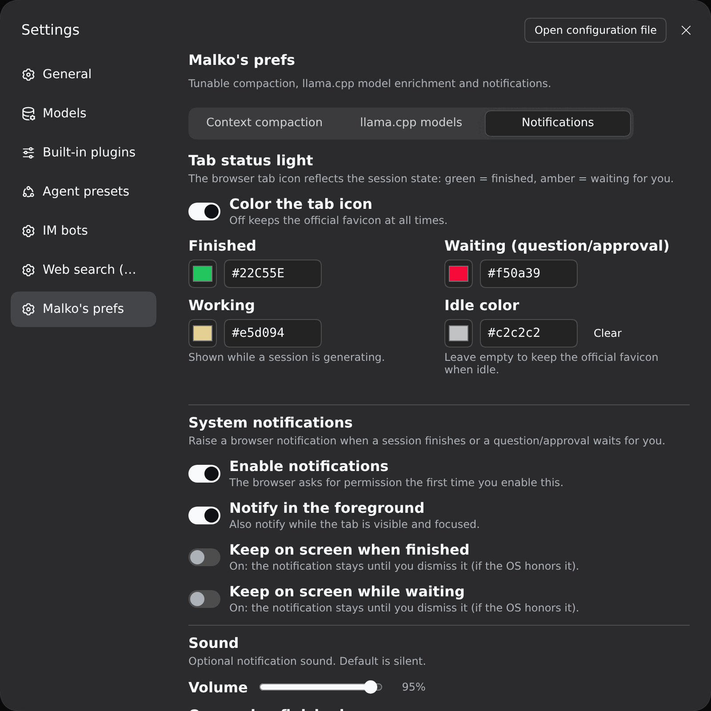
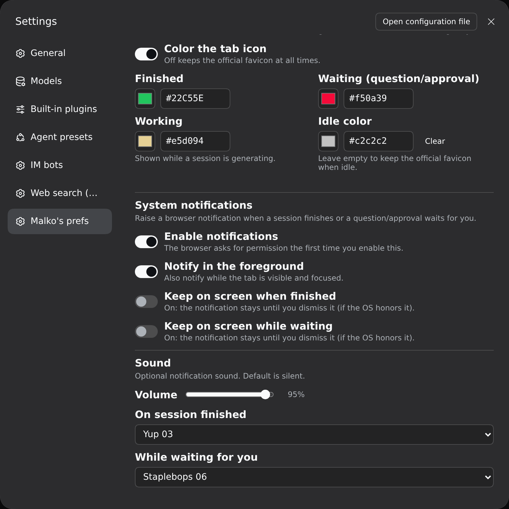

# dsh-malko-prefs

> **Vibe coded.** This plugin was written almost entirely by an AI assistant
> (OpenCode, `deepseek-v4.1-flash`) from natural-language prompts, with light
> human review and testing. It is not a carefully hand-engineered product:
> read the code before trusting it, expect rough edges, and check what it
> changes in your dsh profile — in particular it **restates your agent presets**
> (see [Install](#install)). Use at your own risk.

Personal preferences for DeepSeek Harness (dsh): a **tunable companion to the
official compaction engine**, a **llama.cpp model enrichment** for the Models
page, and **tab notifications**, packaged as a single dsh bundle.

- **Compaction** — the official `@deepseek-ai/dsh-compaction-basic` engine is
  the reference behaviour; this plugin wraps it with a settings page so the
  threshold, the retention, the summarization model/reasoning and an optional
  end-of-turn compaction become user-configurable. It also adds a
  `/force-compact` command.
- **Model enrichment** — reads the richer model metadata a llama.cpp server
  exposes (`meta.n_ctx`, `architecture.input_modalities`, `aliases`) and fills
  the corresponding `llm-pi-ai` model entries (context window, text/image input).
- **Notifications** — the browser tab icon turns amber while a question/approval
  waits for you, blue while a session works, and green when a session finishes
  unattended; the browser raises a notification on either event with an optional
  sound. Ported from
  [`dsh-notice-center`](https://github.com/SCP-QQ/dsh-notice-center) (MIT).

## Requirements

- **dsh ≥ `0.1.7-rc.1`** — built on the current settings domain (`Config`
  fields marked `.volatile()` on the Host, `ctx.configForms` on the Client) and
  on `BasicCompactionEngine`. Tested on `0.1.7-rc.2` and `0.2.0-rc.2`.
- A working `llm-pi-ai` provider (e.g. your llama.cpp server) for the model
  enrichment.

## Install

From the registry (once published):

```
dsh plugin --profile web add dsh-malko-prefs
# then restart dsh web
```

Or from a local checkout / tarball:

```
dsh plugin --profile web add /path/to/dsh-malko-prefs
dsh plugin --profile web add ./dsh-malko-prefs-0.1.0.tgz
```

The bundle layer does two things (see `cordis.patch.yml`):

1. inserts the Host half: the settings service `malkoPrefs` and the
   `malkoModels` probe Service, whose strict Typert wire definition is
   contributed through the package `./typert` export that
   `@deepseek-ai/dsh-typert-loader` registers automatically on mount;
2. restates every shipped agent preset (`preset-cordis`, `preset-ptc`,
   `preset-standard`) with the official `compaction-basic` row retargeted at
   `dsh-malko-prefs/compaction`.

> This second point is why the file is **generated**, not hand-written: a patch
> replaces a row's `config` wholesale and the compaction backend lives nested
> inside the preset, so swapping it means copying the whole preset. Regenerate
> it after a dsh upgrade that touches the presets:
>
> ```
> node scripts/gen-preset-override.mjs                 # auto-detects dsh on PATH
> node scripts/gen-preset-override.mjs <presets-dir>   # or pass it explicitly
> DSH_PRESETS_DIR=<presets-dir> node scripts/gen-preset-override.mjs
> ```
>
> The generated `cordis.patch.yml` is tied to the preset composition of the dsh
> version it was generated against — the plugin targets whichever dsh ships
> those presets (declared through its optional `peerDependencies`).

Rollback: `dsh plugin --profile web remove dsh-malko-prefs` (then restart).

## Settings — “Malko's prefs”

Adds a section to Settings, split into three sub-tabs: **Context compaction**,
**llama.cpp models**, and **Notifications**. All fields are applied **live**
(no restart).

### Context compaction



### Compaction threshold

| Field | Meaning |
|---|---|
| Threshold (tokens) | Absolute pressure in tokens, e.g. `130k` / `130K` / `1.5m`. Empty/0 = use the ratio below. |
| Context window (tokens) | Window the absolute threshold is expressed against (e.g. `200k`). 0 = ratio only. |
| Threshold ratio | Used when the absolute threshold is empty (0.8 = 80% of the window). |
| Headroom (tokens) | Reserved on top of the output cap. The official default (65536) caps the trigger well below 80%. |

Effective trigger: `min(window × ratio, window − output − headroom)`; when an
absolute threshold and a context window are set, it becomes exactly that
threshold. **Default: ratio 0.8 + headroom 32768 → compacts around 160k on a
200k window.**

### Retention

`Keep last (tokens)` (absolute, e.g. `32k`) or `Keep ratio` — the verbatim
recent-context budget.

### Behaviour

- **Automatic compaction** — the official between-step pressure compaction and
  context-overflow recovery.
- **Compact at end of turn** — runs one more compaction when the agent goes
  idle.

### Summarization

- **Model** — `Session model` (default) or `Custom model`.
- **Provider / Model** — shown when `Custom model`; populated from the
  `llm-pi-ai` catalog.
- **Reasoning** — `Default`, `Off`, or any level the selected model declares
  (session mode exposes only `Default` / `Off`). The instruction is appended
  **after** the replayed prefix, so the provider's prompt cache stays warm.

### Advanced

`Summary output cap`, `Extra compaction attempts`, `Overflow recovery attempts`.

### llama.cpp models

For every `llm-pi-ai` provider that declares a `baseURL`, an **Enrich from
server** button reads `GET {baseURL}/models` and completes the model entries
(context window from `meta.n_ctx`/`n_ctx_train`, input modalities from
`architecture.input_modalities`). Existing user values are never overwritten;
new providers adopt the whole list.



### Notifications

Two independent features, both driven by the official client signals
(`sessions`, `uiSession.sessionStatus`); nothing is persisted beyond the config.



**Tab status light** — recolours the browser tab icon:

| Colour | Meaning | Clears when |
|---|---|---|
| amber | a session waits for you (question / approval / plan review) | you handle it |
| working | a session is generating | it stops running |
| green | a main session finished while you were away | you open that session / return to the tab |
| idle | nothing to report (official favicon unless you set a colour) | — |

Priority is amber > working > green > idle, and sub-agent sessions are ignored.
All icon links are repainted together (DSH ships a dark and a light favicon
selected by `prefers-color-scheme`).

**System notifications** — a browser notification on session completion or on a
new pending interaction, with the session name as the title. Defaults to only
firing when the tab is not in the foreground (visible **and** focused); enable
**Notify in the foreground** to also fire while you watch, and one of the two
per-type **Keep on screen** toggles (finished / waiting) to stop that
notification from auto-hiding. Enabling notifications asks
the browser for permission once.

**Sound** — two selectors (finished / waiting), each defaulting to **No sound**.
The list is: `No sound`, two built-in synthesized chimes (`Chime Up` / `Chime
Down`, no asset needed) and 45 bundled opencode sounds (see
[`assets/audio/README.md`](assets/audio/README.md)); picking one previews it and
the Host serves the mp3s at `/malko-prefs-sounds/<id>.mp3`. If that route is
unavailable the player falls back to a chime — but browsers may block audio
until you have interacted with the page at least once.



| Field | Key | Default |
|---|---|---|
| Color the tab icon | `colorsEnabled` | on |
| Finished / Waiting / Working / Idle color | `green` / `amber` / `working` / `black` | official sidebar colors for green/amber, blue for working; `black` empty = official favicon |
| Enable notifications | `notifyEnabled` | **off** |
| Notify in the foreground | `notifyForeground` | off |
| Keep finished on screen | `notifyDonePersistent` | off (auto-hide) |
| Keep waiting on screen | `notifyPendingPersistent` | off (auto-hide) |
| Volume | `notifyVolume` | `0.6` |
| Sound on finished / waiting | `notifyDoneSound` / `notifyPendingSound` | `none` (silent) |

> System notifications need a **secure context** — `http://127.0.0.1:PORT` or
> `localhost`. Opened over a LAN IP the Notification API is unavailable (a
> browser rule, not a plugin one); the tab status light still works.

## Commands

- `/compact` — the official dsh command (idle manual compaction).
- `/force-compact` — compact **now**: immediately when the agent is idle,
  otherwise queued and consumed at the next model step (bypasses the threshold).

## How it works

```
host plugin  (lib/index.mjs)
  ├─ Config (volatile)  ──▶ settings page "malko-prefs"
  ├─ service malkoPrefs ──▶ live prefs + force queue
  ├─ service malkoModels ──▶ llama.cpp probe (wire def in lib/typert.host.mjs)
  ├─ /malko-prefs-sounds/<id>.mp3 ──▶ bundled sound library
  └─ /force-compact command

client plugin (lib/client.js)
  ├─ mounts its own malkoModels Remote via ctx.remote.$mount()
  ├─ tab status light + notifications (src/notify.ts, optional uiSession)
  └─ settings page: 3 sub-tabs (compaction / models / notifications)

preset plugin (lib/compaction.mjs)
  └─ MalkoCompactionEngine extends BasicCompactionEngine
       ├─ rebuilds its policy from malkoPrefs before each operation
       ├─ summarize() → model + reasoning control (cache-safe order)
       └─ agent/status idle → optional turn-end compaction
```

The engine reuses the official engine for everything else (durable
transactions, pruning, overflow recovery), so behaviour matches
`compaction-basic` unless a preference changes it.

Note: service classes avoid JS private members (`#x`) — cordis binds service
methods to a proxy, and private members would throw
`Receiver must be an instance of class ...`.

## Development

```
node build.mjs            # esbuild → lib/{index,compaction,typert.host}.mjs + lib/client.js
node scripts/check.mjs    # static conformance checks
```

| File | Role |
|---|---|
| `src/prefs.ts` | preference fields, defaults, `parseTokenText` |
| `src/index.ts` | host plugin: volatile Config, `malkoPrefs`, `/force-compact` |
| `src/compaction.ts` | `MalkoCompactionEngine` (extends the official engine) |
| `src/remote.ts` | shared wire identity + `probeInvocation()` builder |
| `src/typert.ts` | Host Typert manifest (zod strict codecs) |
| `src/typert.host.ts` | the `./typert` export entry `dsh-typert-loader` imports |
| `src/probe.ts` | `malkoModels` Service (llama.cpp `/models` probe) |
| `src/client.ts` | settings page (three sub-tabs) |
| `src/notify.ts` | tab status light + notifications + sound player (ported from dsh-notice-center) |
| `assets/audio/` | 45 bundled notification sounds (opencode, MIT) |
| `src/whale.ts` | the recolored official whale SVG used as the tab icon |
| `scripts/gen-preset-override.mjs` | regenerates `cordis.patch.yml` from the installed presets |
| `scripts/check.mjs` | manifest / bundle / cache-safety checks |

## Publishing

The package is publication-ready:

- `private` is removed; `LICENSE` (MIT) and `author` are set; `files` ships
  `lib/`, `cordis.patch.yml`, `scripts/`, `assets/` and `LICENSE`.
- `prepublishOnly` runs the build and `scripts/check.mjs`.
- Conformant bundle: `dsh.bundle.patch`, `exports["./client"]` and
  `exports["./package.json"]`, the client bundle id equals the package name,
  and the client requires only baseline platform modules (`react`,
  `@deepseek-ai/dsh-client-ui-primitives`).
- The name is free on npmjs.com; release with `npm publish` (unscoped/public).

Caveat: `cordis.patch.yml` is generated from the shipped presets, so regenerate
it against the dsh version you target and keep the `peerDependencies` ranges in
sync before publishing.

## Limits

- The generated `cordis.patch.yml` copies the shipped presets; re-run
  `gen-preset-override.mjs` after a dsh upgrade.
- The `/force-compact` busy path uses the engine's context-overflow entry,
  which compacts the maximal safe head (retention 0).
- The model enrichment is host-side (the browser cannot reach a local
  llama.cpp server cross-origin).
- Browser notifications require a secure context (`127.0.0.1`/`localhost`); the
  tab status light's green/amber state is in-memory and resets on reload.
- Notification sound is best-effort: browsers may block audio until the page has
  had a user gesture, and if the `/malko-prefs-sounds` route is unavailable the
  player falls back to a synthesized chime.
